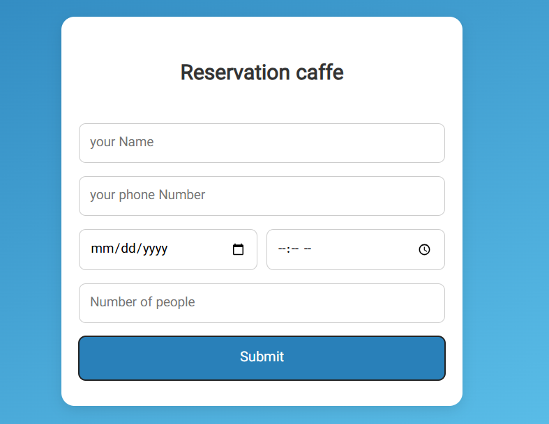
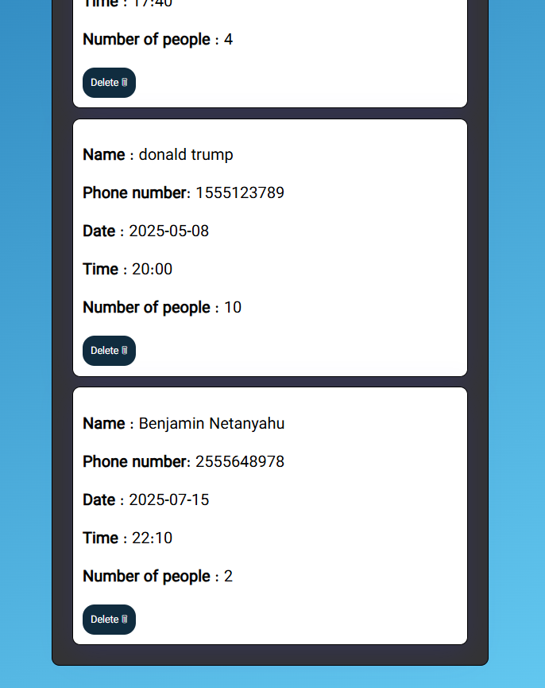

# 📅 caffe Reservation App

A simple and lightweight reservation manager built using **vanilla JavaScript**, HTML, and CSS — no frameworks or libraries used.

---

## 🧠 Features

- Add new reservations (name, phone, date, time, people count)
- Store all data in `localStorage`
- Delete reservations easily
- Fully responsive and user-friendly
- **No libraries** or frameworks – 100% pure JS/HTML/CSS ✅

---

## 🔗 Live Demo

👉 [Click to view on GitHub Pages](https://aminbaniamer.github.io/reservation-caffe/)

---

## 📸 Overview

---
